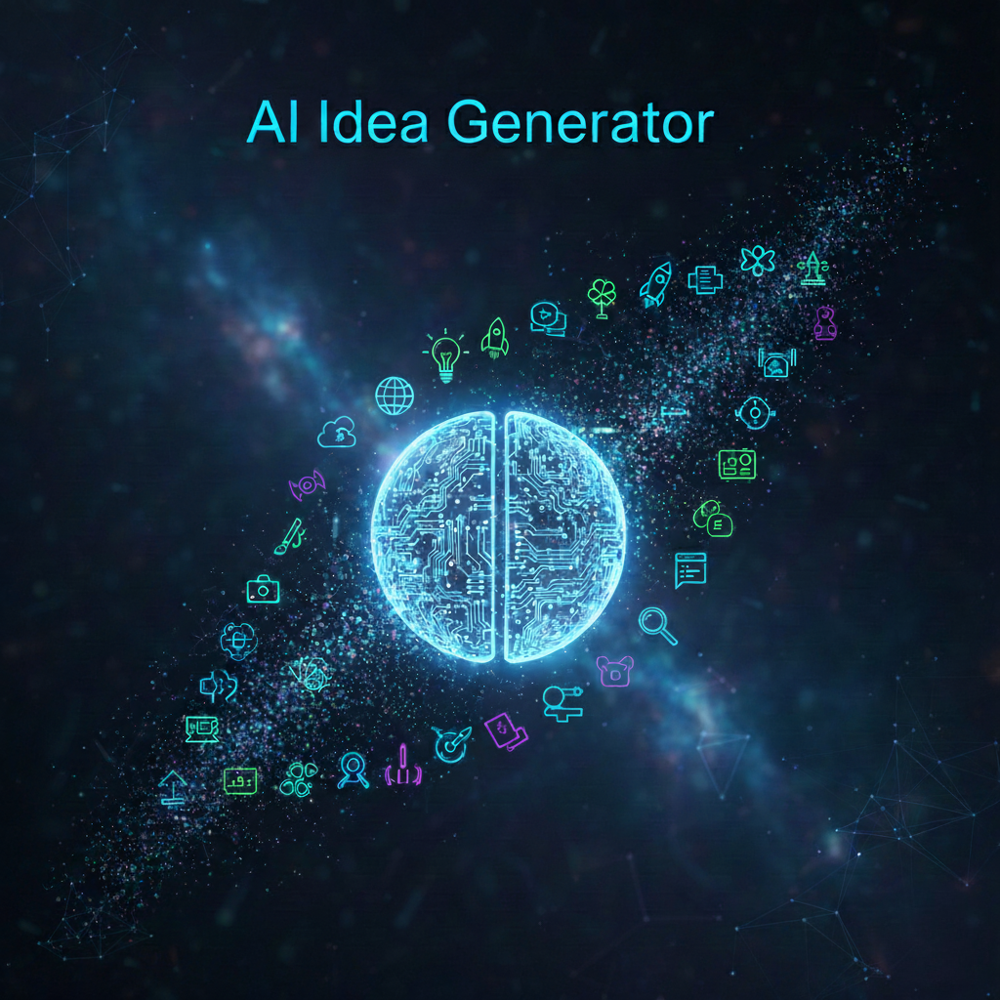
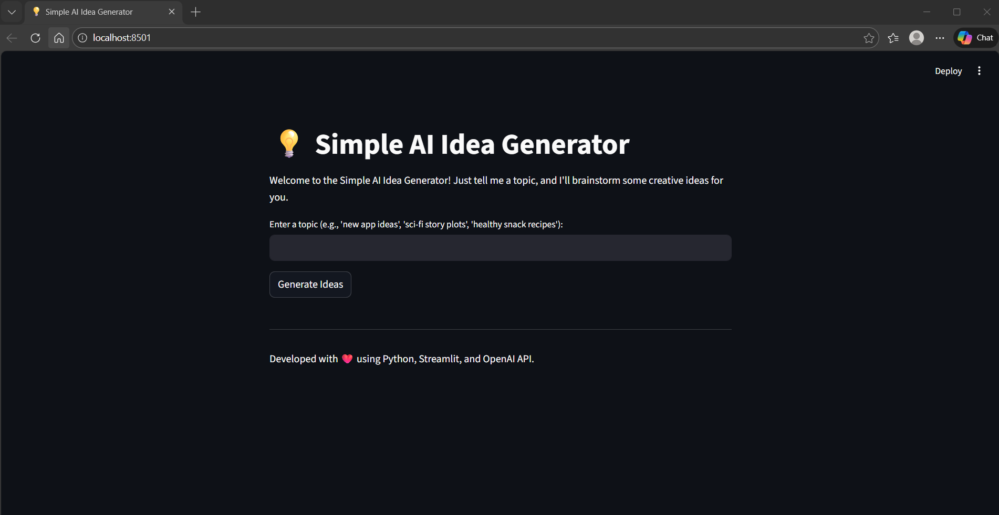
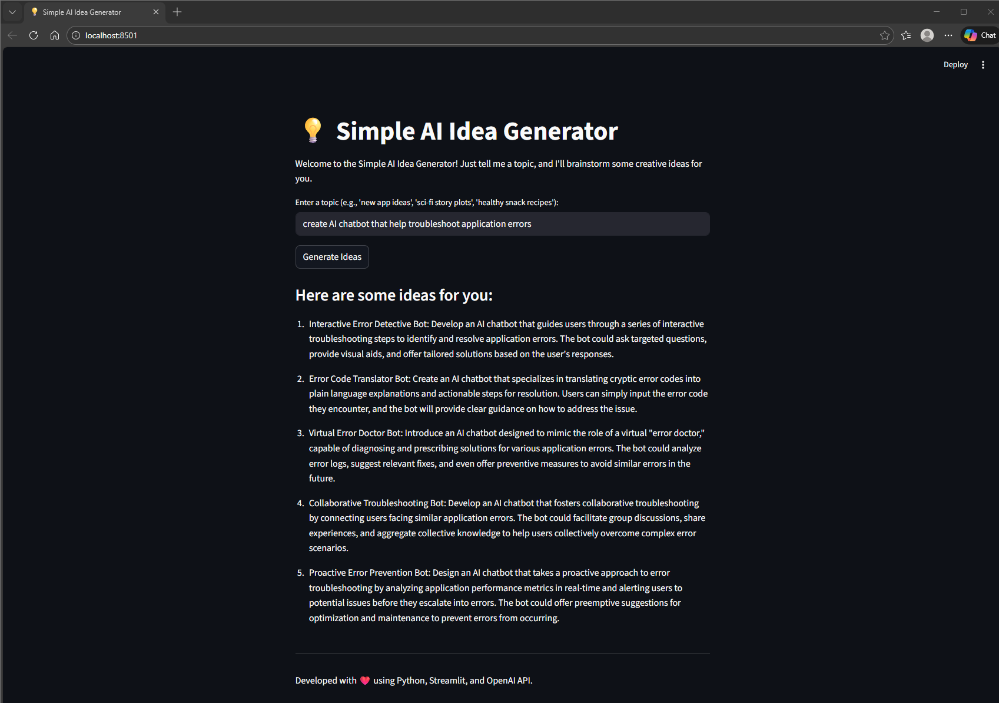

<p align="center">
  
</p>

# AI IDEA GENERATOR

As I dive into the Generative AI space I came up with this project idea to utilize AI to assist in creating other AI projects, initiatives, or efforts.

This AI project creates a web application where users can input a broad topic, and an AI (powered by OpenAI's GPT model) will generate a list of creative and unique ideas related to that topic.

In this project will incorporate AI, Python, and web interfaces.

The Tools I used:

- Python: The core programming language.
- Streamlit: [Python Library] For building a simple, interactive web user interface without needing complex web development knowledge.
- OpenAI API: To leverage the power of a large language model (LLM) like GPT for idea generation.

Project Structure:

ai-idea-generator/

├── .env

├── app.py

└── requirements.txt

### **Setup Instructions**

1. Set up your Environment

- Create a Project Folder:
  Start by creating a new directory for your project. You can name it ai-idea-generator.
  `mkdir ai-idea-generator`
  Then change directories in the project folde
  `cd ai-idea-generator`

- Create a Virtual Environment (Recommended):
  This helps isolate your project's dependencies from other Python projects.
  `python -m venv venv`

- Activate the Virtual Environment:
  `python -m venv venv`

- Install Required Libraries:
  Create a file named requirements.txt in your ai-idea-generator folder. Open it with a text editor and add the following lines:
  streamlit
  openai
  python-dotenv

- Save the file, then open your terminal (with the virtual environment activated in your project folder) and run:
  `pip install -r requirements.txt`

2. Get Your OpenAI API Key

- Access OpenAI Platform: Go to the OpenAI Platform website: https://platform.openai.com/
- Sign Up/Log In: If you don't have an account, sign up. Otherwise, log in.
- Navigate to API Keys: Look for "API keys" in your account settings or the left-hand navigation.
- Create New Key: Click on "Create new secret key" and immediately copy the key that appears. It's crucial to copy it now, as you won't be able to see it again! Keep this key absolutely secret and do not share it publicly.

3. Store Your API Key Securely (.env file)

- In your ai-idea-generator project folder, create a new file named .env (make sure it starts with a dot).
- Open the .env file with a text editor and add the following line, replacing your_openai_api_key_here with the actual key you copied from OpenAI:
  OPENAI_API_KEY=your_openai_api_key_here
    - **Please be sure to remove your OPENAI API KEY from .env file if you are pushing this project to a remote repo. OR store your OpenAI API Key in a secrets manager**

4. Create the Streamlit Application (app.py)
   Create a file named app.py in your ai-idea-generator folder.

5. Run Your Application

- Activate Virtual Environment: Ensure your virtual environment is activated in your terminal. If not, navigate to your ai-idea-generator directory and run:
  - On macOS/Linux: source venv/bin/activate
- Run Streamlit: From your project directory in the terminal, run the following command:
  `streamlit run app.py`

***Once you are done with tesing your web app locally, execute the command below to stop the virtual environment:***

```deactivate```

***Please be sure to remove your OPENAI API KEY from .env file if you are pushing this project to a remote repo. OR store your OpenAI API Key in a secrets manager***


### **AI IDEA GENERATOR - Web Application**

<p align="center">
  
</p>

<p align="center">
  
</p>
